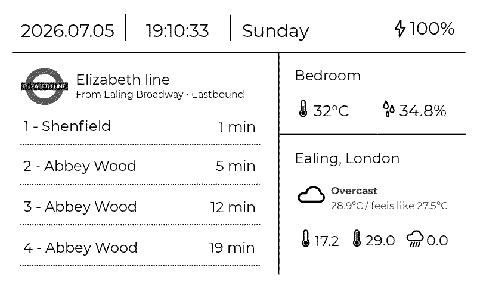

# Yet Another Dashboard for reTerminal E1001

A TfL + weather + bedroom sensors dashboard for the [reTerminal E1001](https://www.seeedstudio.com/reTerminal-E1001-p-6346.html), with a Cloudflare Worker API and full-screen 1-bit ePaper refresh.



The slow refresh of SenseCraft HMI simply wasn't cutting it for my ideal use case, and the absolute positioning of UI elements was also very annoying, as my fonts are not monospaced. 

So I decided to rewrite everything in Arduino (not Rust!)...

## Setup

Everything you need to run the dashboard is already in the repo — **icon and font headers under `arduino/dashboard/` are pre-generated**. You do not need to run asset or font conversion scripts unless you are changing those source files (see [Development](#development)).

### 1. Configure environment

Copy `.env.example` to `.env` and fill in your values, then sync derived config files:

```bash
cp .env.example .env
npm run sync-env
```

This writes:

| File | Purpose |
| --- | --- |
| `cloudflare/.dev.vars` | API keys for local `wrangler dev` |
| `cloudflare/wrangler.jsonc` | Worker vars (TfL stop, weather location, cache TTLs) and KV namespace binding |
| `arduino/dashboard/config.h` | `WORKER_URL`, WiFi credentials, refresh intervals (gitignored) |

Re-run `npm run sync-env` whenever you change `.env`.

### 2. Deploy the Cloudflare worker

```bash
cd cloudflare
npm install
npm run deploy
```

Set production secrets once:

```bash
npx wrangler secret put TFL_API_KEY
npx wrangler secret put METOFFICE_API_KEY
```

The worker caches TfL and weather data in a **KV namespace** (`CACHE` binding in `wrangler.jsonc`). Namespace IDs are safe to commit — they are resource identifiers, not secrets. If you deploy to your own Cloudflare account for the first time, create namespaces and update the IDs in `wrangler.jsonc`:

```bash
cd cloudflare
npx wrangler kv namespace create CACHE
npx wrangler kv namespace create CACHE --preview
```

Put the deployed worker URL in `.env` as `WORKER_URL`, then run `npm run sync-env` again so the firmware picks it up.

For local worker development: `npm run dev` (http://localhost:8787). Local dev uses the preview KV namespace; API responses are not edge-cached (`Cache-Control: private, no-store`).

### 3. Flash the Arduino firmware

**Libraries** (Arduino Library Manager or manual install):

- [Seeed_GFX](https://github.com/Seeed-Studio/Seeed_GFX) — enable `#define SMOOTH_FONT` in `User_Setup.h`
- [ArduinoJson](https://arduinojson.org/)
- [Sensirion I2C SHT4x](https://github.com/Sensirion/arduino-i2c-sht4x)

**Board config:** generate `driver.h` for the reTerminal E1001 using the [Seeed GFX Configuration Tool](https://wiki.seeedstudio.com/epaper_work_with_arduino/) (board combo **520**).

**Flash** `arduino/dashboard/dashboard.ino` to the device. Ensure `npm run sync-env` has populated `arduino/dashboard/config.h` with your WiFi and worker URL.

## Development

These steps are only needed when **changing source assets or fonts**, not for normal setup.

### Environment sync

`npm run sync-env` — propagates `.env` to Cloudflare and Arduino config. Run after any `.env` edit.

### SVG → Arduino icon headers

Source SVGs live in `assets/` (icons, weather, TfL). Generated 1-bit PROGMEM headers are committed under `arduino/dashboard/assets/`.

If you add or edit an SVG:

```bash
npm run convert-assets
```

Re-flash the firmware after regenerating headers.

### Montserrat fonts

VLW font headers are committed under `arduino/dashboard/fonts/`. The firmware auto-enables Montserrat when those headers are present.

To regenerate fonts from `assets/fonts/*.ttf`:

```bash
npm run generate-fonts   # writes manifest + instructions
```

Follow `arduino/dashboard/fonts/README.md` to produce new `.h` files with TFT_eSPI's `Create_font.pde`, then commit them.

For the **browser preview** only:

```bash
npm run setup-fonts      # downloads TTF + woff2 into preview/fonts/files/
```

### Layout preview 

Smoke-test the 800×480 layout in a browser — no device required (though not very accurate haha):

```bash
npm run preview
```

Open [http://localhost:5173/preview/](http://localhost:5173/preview/). The preview script downloads Montserrat web fonts automatically on first run.

---

---

## Design notes

I wanted TfL ETAs on the E1001 without the full-panel flicker of SenseCraft HMI's refresh cycle, which takes ~3 seconds per refresh and looks glitchy. 

I originally wanted to recreate the dashboard with 1-bit partial updates for the maximum smoothness, but experienced multiple issues including but not limited to: 

* Differential fading, where static elements fade in color over time.
* Ghosting artifacts, where previous text are not fully cleared by the partial updates.
* Ink bleeding, where the background turns grayish over time, no idea why this happens.

so this firmware uses **1-bit full-screen GC refresh** (`epaper.update()`) on a fixed schedule instead of partial updates. With a 1-bit design, the refresh flicker is fast enough for me so that it actually looks like a refresh rather than a display glitch. 

### Data sources

- On-device RTC (NTP, Europe/London timezone), battery, SHT4x temperature/humidity
- [Met Office DataHub](https://datahub.metoffice.gov.uk/) — site-specific forecast (via worker)
- [TfL Unified API](https://api-portal.tfl.gov.uk/) (via worker)

### Tech stack

- Arduino + [Seeed_GFX](https://github.com/Seeed-Studio/Seeed_GFX)
- [Cloudflare Worker](https://developers.cloudflare.com/workers/) — JSON API (`/`, `/tfl`, `/weather`), KV-backed caching

### Refresh behaviour

| What | Interval |
| --- | --- |
| Display (full GC refresh) | 20 s |
| TfL fetch | 20 s |
| Bedroom sensors + battery | 3 min |
| Weather fetch (worker caches Met Office for 15 min) | 15 min |
| Date rollover | midnight |

Stale API data keeps the last good payload on screen; a hourglass icon indicates stale TfL data, a warning icon indicates disruption or non–Good Service.

### API response shape

```json
{
  "tfl": {
    "line": "Elizabeth line",
    "stop": "Ealing Broadway",
    "direction": "Eastbound",
    "status": "Good Service",
    "disruption": false,
    "etas": [{ "destination": "Shenfield", "minutes": 1 }, { "destination": "Abbey Wood", "minutes": 2 }]
  },
  "weather": {
    "location": "Ealing, London",
    "description": "Overcast",
    "icon": "wi-cloudy",
    "tempC": 28.9,
    "feelsLikeC": 27.5,
    "minC": 17.2,
    "maxC": 29.0,
    "precipMm": 0.0
  }
}
```

### Image assets

Credits: [SenseCraft HMI](https://sensecraft.seeed.cc/hmi), [erikflowers/weather-icons](https://github.com/erikflowers/weather-icons).
